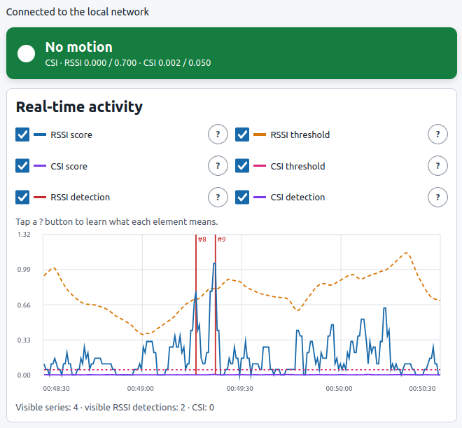
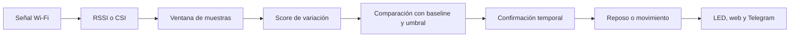
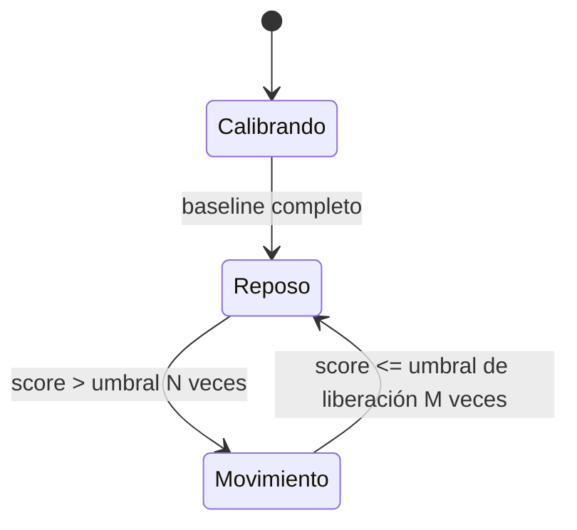

# WiFi Motion RSSI — sensor de movimiento con ESP32-C3

[English](README.md) | **Español**

Detector de movimiento que utiliza cambios en una señal Wi-Fi. El
ESP32-C3 no necesita cámara, micrófono ni un sensor PIR: observa cómo varía el
enlace de radio entre el punto de acceso y el propio dispositivo.

El proyecto incluye detector RSSI, captura CSI, calibración
adaptativa, gráfica web, selección de red Wi-Fi, acceso de administrador,
notificaciones por Telegram y telemetría para evaluar el comportamiento real.



> [!IMPORTANT]
> Este proyecto detecta **cambios compatibles con movimiento**, no personas.
> No identifica a nadie, no cuenta ocupantes y no garantiza detectar a una
> persona inmóvil. No es una alarma de seguridad certificada.

## Contenido

- [La idea en un minuto](#la-idea-en-un-minuto)
- [Qué mide realmente](#qué-mide-realmente)
- [Cómo decide que existe movimiento](#cómo-decide-que-existe-movimiento)
- [RSSI: detector principal y recomendado](#rssi-detector-principal-y-recomendado)
- [CSI: detector de canal](#csi-detector-de-canal)
- [Significado de todos los parámetros](#significado-de-todos-los-parámetros)
- [Estados, gráfica e hitos](#estados-gráfica-e-hitos)
- [Colocación y calibración](#colocación-y-calibración)
- [Primer arranque y portal web](#primer-arranque-y-portal-web)
- [Notificaciones de Telegram](#notificaciones-de-telegram)
- [Seguridad](#seguridad)
- [Firmware precompilado](#firmware-precompilado)
- [Compilación, instalación y pruebas](#compilación-instalación-y-pruebas)
- [API local](#api-local)
- [Telemetría y experimentos](#telemetría-y-experimentos)
- [Solución de problemas](#solución-de-problemas)
- [Arquitectura del firmware](#arquitectura-del-firmware)
- [Limitaciones](#limitaciones)

## La idea en un minuto

Una señal Wi-Fi no viaja únicamente en línea recta. Rebota en paredes, muebles,
suelo y objetos. Al receptor llegan muchas copias de la misma onda por caminos
distintos; este fenómeno se llama **multitrayecto**.

Cuando alguien se mueve, tapa algunos caminos, refleja otros y modifica la suma
de todas esas ondas. El ESP32 intenta reconocer esa perturbación:

```text
Router  ~~~~~~~ camino directo ~~~~~~~>  ESP32-C3
   \                                  /
    \____ rebotes en paredes ________/
          ↑
       una persona cambia los caminos de propagación
```

El proceso completo es:



Una muestra aislada nunca basta. El detector observa una ventana, calcula cuánto
está cambiando la señal y exige varias superaciones consecutivas del umbral.

## Qué mide realmente

### RSSI

RSSI significa *Received Signal Strength Indicator*. Es una estimación de la
potencia total recibida y normalmente se expresa en dBm. Por ejemplo, `-45 dBm`
representa una señal más fuerte que `-75 dBm`.

El firmware consulta periódicamente al controlador Wi-Fi mediante
`esp_wifi_sta_get_ap_info()`. Lo útil para detectar no es que el RSSI sea alto o
bajo, sino **cuánto cambia en el tiempo**.

Un RSSI constante en `-65 dBm` suele producir un score bajo. Una secuencia como
`-65, -62, -68, -64…` genera un score mayor y puede indicar una perturbación.

RSSI tiene ventajas importantes:

- funciona con un ESP32-C3 y un router normal;
- consume poca memoria y poco cálculo;
- es sencillo de interpretar;
- en este proyecto es la opción recomendada para los avisos reales.

También pierde mucha información: resume todo el canal en un solo número. Dos
escenas diferentes pueden producir el mismo RSSI.

### CSI

CSI significa *Channel State Information*. En lugar de un único valor, describe
cómo llega la señal en múltiples subportadoras OFDM. Cada subportadora aporta
componentes complejas que contienen información de amplitud y fase.

Una comparación intuitiva:

| Medida | Qué entrega | Analogía |
|---|---|---|
| RSSI | Un número global de potencia | El volumen total de una canción |
| CSI | Muchos valores por subportadora | Las frecuencias individuales de un ecualizador |

CSI puede observar cambios más finos, pero su respuesta depende especialmente
del router, el tráfico, el canal, el formato de trama, la orientación y la
geometría. El método funciona en la instalación validada; al trasladarlo conviene
recalibrar y comprobar sus contadores de calidad.

### Lo que no mide

El sistema no mide distancia, velocidad, identidad, temperatura ni presencia
humana de forma directa. Solo clasifica cambios de radio como reposo o
movimiento. Una puerta, una mascota, un ventilador, interferencias o cambios del
router también pueden perturbar la señal.

## Cómo decide que existe movimiento

RSSI y CSI terminan entrando en la misma máquina de estados. La cadena tiene
siete pasos.

### 1. Muestreo

Cada `interval_ms` se obtiene una nueva observación. Con el valor predeterminado
de `100 ms`, el firmware consulta diez veces por segundo.

Consultar diez veces no garantiza diez valores físicos nuevos: el controlador
Wi-Fi puede repetir el RSSI hasta actualizar su estimación. La telemetría cuenta
estas repeticiones para no confundir frecuencia de consulta con frecuencia real
de cambio.

### 2. Ventana deslizante

Se conservan las últimas `window_size` muestras. Con 20 muestras y 100 ms, la
ventana representa aproximadamente dos segundos:

```text
duración de ventana ≈ window_size × interval_ms
                   ≈ 20 × 100 ms = 2 s
```

Cada nueva muestra desplaza la ventana y produce un nuevo score.

### 3. Score

El **score** resume la variación reciente. Un valor pequeño significa que la
señal se parece al reposo; uno grande significa que está cambiando más.

El número no es una probabilidad ni un porcentaje. Su escala depende de la
fuente y del algoritmo. Un score `0,5` no significa “50 % de movimiento”.

### 4. Calibración y baseline

Al arrancar o solicitar una recalibración, el detector recoge
`calibration_samples` scores con la habitación quieta. De ellos obtiene:

- **centro del baseline:** nivel normal de variación;
- **dispersión del baseline:** cuánto fluctúa normalmente ese nivel.

El baseline es, por tanto, la firma estadística de una habitación en reposo. No
es una única muestra de RSSI.

Con los valores predeterminados, la calibración RSSI tarda aproximadamente:

```text
(window_size + calibration_samples) × interval_ms
(20 + 120) × 100 ms ≈ 14 s
```

Es una aproximación. CSI depende además de que lleguen suficientes tramas.

### 5. Umbral adaptativo

El umbral de activación se calcula así:

```text
umbral = máximo(
    umbral_mínimo,
    centro_baseline + multiplicador_sigma × dispersión_baseline
)
```

Esto combina dos protecciones:

- si el ambiente es muy estable, el umbral mínimo evita reaccionar a ruido
  diminuto;
- si el ambiente ya es variable, el baseline eleva el umbral para reducir
  falsas alarmas.

Un multiplicador sigma alto exige una perturbación más excepcional y reduce la
sensibilidad. Uno bajo facilita la activación.

### 6. Confirmación temporal

Para entrar en movimiento, el score debe superar el umbral durante
`trigger_consecutive` resultados consecutivos. Un pico aislado no activa el
sensor.

Con intervalo de 100 ms y confirmación de 3, la confirmación ideal añade unos
300 ms, aunque la latencia total también incluye la ventana y la actualización
real del Wi-Fi.

### 7. Histéresis y liberación

El detector utiliza un umbral inferior para volver a reposo:

```text
umbral_liberación = umbral_activación × ratio_liberación
```

Si el umbral de activación es `0,40` y el ratio `0,75`, el umbral de liberación
es `0,30`. Esta separación se llama **histéresis**. Evita que el estado oscile
rápidamente cuando el score está justo en el límite.

Además, el score debe permanecer por debajo del umbral de liberación durante
`clear_consecutive` resultados consecutivos.



## RSSI: detector principal y recomendado

### Algoritmos disponibles

Todos calculan un score sobre la misma ventana de RSSI.

| Algoritmo | Qué calcula | Cuándo resulta útil |
|---|---|---|
| Diferencia media | Promedio de `|x[i] - x[i-1]|` | Detecta cambios sucesivos; opción inicial recomendada |
| Desviación estándar | Dispersión respecto a la media | Mide variabilidad general con unidades comparables al RSSI |
| Varianza | Cuadrado de la dispersión | Amplifica diferencias grandes; cambia mucho la escala del score |
| Rango | Máximo menos mínimo | Muy intuitivo, pero sensible a un único pico |
| Desviación mediana | Mediana de `|x - mediana(x)|` | Resiste mejor valores aislados anómalos |

No existe un algoritmo universalmente mejor. Para comparar dos algoritmos hay
que usar las mismas capturas y recalibrar, porque sus scores tienen escalas
diferentes.

### Modelos de baseline

| Modelo | Centro | Dispersión | Comportamiento |
|---|---|---|---|
| Media y desviación | Media | Desviación estándar muestral | Adecuado para ruido bastante regular; sensible a picos |
| Mediana robusta | Mediana | MAD × 1,4826 | Tolera mejor observaciones aisladas y distribuciones irregulares |

MAD es la mediana de las distancias absolutas a la mediana. El factor `1,4826`
la lleva a una escala comparable con la desviación estándar cuando los datos se
parecen a una distribución normal.

### Adaptación del baseline

La habitación cambia lentamente: temperatura del equipo, interferencias, nivel
de señal o muebles pueden alterar el enlace. Para no quedarse anclado a la
calibración inicial, el firmware actualiza despacio el baseline.

La adaptación solo ocurre en reposo y cuando el score está por debajo del
umbral de liberación. Así se reduce el riesgo de aprender un movimiento como si
fuera normal:

```text
nuevo_baseline = baseline_actual
               + alpha × (baseline_candidato - baseline_actual)
```

`alpha` pequeño implica adaptación lenta. Con `0,01`, solo se aplica un 1 % de
la diferencia en cada actualización.

## CSI: detector de canal

### De una trama CSI al score

El ESP32 recibe pares de componentes por subportadora. El extractor calcula,
entre otras características:

- amplitud media;
- varianza y rango de amplitud;
- energía media;
- cambio temporal absoluto;
- cambio temporal normalizado;
- distancia de correlación compleja entre tramas consecutivas.

La distancia de correlación vale cerca de cero cuando dos tramas CSI son muy
parecidas y aumenta cuando cambia la forma compleja del canal.

El detector CSI actual utiliza el **pico agregado de distancia de correlación
compleja**. Esa secuencia entra en un segundo detector que trabaja en paralelo
al RSSI.

Su configuración actual es fija:

| Parámetro CSI | Valor |
|---|---:|
| Ventana | 20 |
| Calibración | 120 scores |
| Algoritmo | Diferencia media |
| Baseline | Mediana/MAD |
| Sigma | 6,0 |
| Umbral mínimo | 0,05 |
| Ratio de liberación | 0,75 |
| Activación / liberación | 3 / 8 |

### Por qué el score CSI parece siempre cero

Es normal que sea mucho menor que el score RSSI. Valores como `0,002` o `0,009`
pueden redondearse visualmente y parecer cero, pero no lo son. Con un umbral
mínimo de `0,05`, siguen siendo insuficientes para activar el detector.

Si es exactamente cero durante mucho tiempo, comprueba en diagnóstico:

- `csi_frames_received`: deben llegar tramas;
- `csi_frames_processed`: deben procesarse;
- `csi_frames_dropped`: no debería crecer continuamente;
- `csi_traffic_requests` y `csi_traffic_replies`: indican si el tráfico
  controlado está funcionando;
- `csi_detector_sampled`: confirma que el detector recibió una muestra nueva.

El firmware genera tráfico ICMP hacia la puerta de enlace para favorecer una
cadencia CSI estable. Por defecto solicita tráfico cada 50 ms, con un byte de
carga y timeout de 200 ms. Aun así, algunos routers, tramas o geometrías pueden
producir poca información útil.

### Selector de fuente

| Opción web | Estado principal y Telegram |
|---|---|
| Solo RSSI | Se activan únicamente con el detector RSSI |
| Solo CSI | Se activan únicamente con CSI |
| RSSI o CSI | Se activan si cualquiera de los dos detecta |

“Ambas” implementa un **OR**, no exige que coincidan. Si RSSI detecta pero está
seleccionado “Solo CSI”, la gráfica RSSI puede marcar movimiento sin activar la
tarjeta principal, el LED ni Telegram.

RSSI y CSI están disponibles como fuentes de operación. Conviene elegir la que
mejor responda en la instalación real y recalibrarla después de cambiar el
dispositivo, el router o la geometría.

## Significado de todos los parámetros

Los cambios de detector y Wi-Fi solo se aplican al pulsar
**Guardar Wi-Fi y detector; reiniciar**. El botón de Telegram guarda únicamente
Telegram.

| Parámetro | Efecto al aumentarlo | Riesgo al reducirlo demasiado |
|---|---|---|
| Intervalo | Menos consultas y reacción más lenta | Más carga y más muestras repetidas; no obliga al driver a actualizar RSSI |
| Ventana | Score más estable y lento | Score nervioso y sensible a picos |
| Calibración | Baseline inicial más representativo | Baseline pobre por pocas observaciones |
| Multiplicador sigma | Menos sensibilidad y falsas alarmas | Más activaciones por ruido normal |
| Umbral mínimo | Ignora variaciones pequeñas | Falsas alarmas en ambientes muy estables |
| Ratio de liberación | Cuesta más distinguir ambos umbrales si se acerca a 1 | El estado puede tardar más en liberarse si es muy bajo |
| Adaptación baseline | Sigue antes cambios ambientales | Puede absorber perturbaciones lentas como normales |
| Confirmación activación | Menos picos aislados, mayor latencia | Activaciones breves no confirmadas |
| Confirmación liberación | Movimiento permanece más estable | Puede volver a reposo demasiado pronto |

### Perfiles

Los perfiles rellenan varios campos de sensibilidad; funcionan como presets y
sus valores quedan visibles antes de guardar.

| Perfil | Sigma | Liberación | Alpha | Activación | Liberación | Resultado esperado |
|---|---:|---:|---:|---:|---:|---|
| Baja sensibilidad | 8,0 | 0,75 | 0,01 | 4 | 10 | Menos falsas alarmas, más latencia |
| Equilibrado | 6,0 | 0,75 | 0,01 | 3 | 8 | Punto de partida recomendado |
| Alta sensibilidad | 4,0 | 0,70 | 0,02 | 2 | 5 | Respuesta rápida, más riesgo de falsos positivos |

Cambiar el perfil en la web sí modifica esos campos. No cambia por sí solo el
algoritmo, el tipo de baseline, la ventana ni el número de muestras de
calibración.

### Valores con muchos decimales

El ESP32 almacena algunos parámetros como `float` de 32 bits. Un valor decimal
como `0,31` puede representarse internamente como `0,310000002384186`. Es una
limitación normal de la representación binaria, no una recalibración misteriosa.
La web redondea los campos al paso permitido antes de mostrarlos y guardarlos.

## Estados, gráfica e hitos

La tarjeta principal puede mostrar:

- **Calibrando:** todavía no existe baseline suficiente;
- **Sin movimiento:** score por debajo de las reglas de activación;
- **Movimiento detectado:** la fuente seleccionada confirmó el evento;
- **Error de lectura:** no hay una muestra válida para la fuente necesaria.

La gráfica conserva aproximadamente los últimos dos minutos y permite mostrar u
ocultar:

- score RSSI;
- umbral RSSI;
- score CSI;
- umbral CSI;
- hitos de entrada RSSI;
- hitos de entrada CSI.

Un hito marca una transición de reposo a movimiento, no cada muestra mientras
el estado continúa activo. Los botones `?` explican cada serie.

La gráfica del navegador es una visualización en vivo: al recargar la página se
reinicia su historial. La telemetría serie es la vía adecuada para conservar una
sesión experimental completa.

## Colocación y calibración

### Colocación recomendada

1. Coloca router y ESP32 en posiciones fijas.
2. Evita que el ESP32 cuelgue de cables que puedan moverse.
3. Sitúa el trayecto que quieres observar dentro de una zona con propagación
   entre ambos equipos.
4. Mantén orientación, altura, canal y ubicación durante las comparaciones.
5. Alimenta el ESP32 con un cargador USB estable cuando ya no necesites el
   monitor serie.

No hace falta que una persona cruce exactamente una línea óptica: los rebotes
también importan. Sin embargo, la respuesta cambia mucho con la geometría y
normalmente es mayor al atravesar caminos relevantes entre router y receptor.

### Recalibración manual

Desde el portal se puede programar una recalibración con 10, 20, 30 o 60
segundos de espera:

1. selecciona el retraso;
2. pulsa el botón de recalibración;
3. sal de la habitación antes de que termine la cuenta atrás;
4. mantén la escena quieta hasta que indique que ambos detectores están listos.

Conviene recalibrar después de cambiar de ubicación, orientación, router, canal,
muebles importantes, algoritmo o parámetros que alteran la escala del score.

No calibres mientras alguien camina: el sistema aprendería una habitación en
movimiento como referencia normal y el umbral podría quedar demasiado alto.

## Primer arranque y portal web

### Modo estación

Con credenciales válidas, el ESP32 se conecta a una red Wi-Fi de 2,4 GHz. Abre
en un navegador la dirección IP asignada por el router, por ejemplo:

```text
http://192.168.1.50
```

El portal usa HTTP local. El aviso del navegador sobre campos de contraseña en
una página insegura es correcto: no expongas el dispositivo a Internet y usa una
red local de confianza.

### Modo de recuperación

Si no hay credenciales o no puede conectarse, crea el punto de acceso:

```text
SSID: WiFi-Motion-XXXXXX
Contraseña inicial: motion-setup
Portal: http://192.168.4.1
```

No hace falta restaurar el dispositivo al cambiar de casa. Tras varios intentos
fallidos con la red anterior, el AP de recuperación se activa sin borrar Wi-Fi,
detector, acceso admin ni Telegram. Conéctate a `WiFi-Motion-XXXXXX`; su DNS
cautivo redirige las páginas HTTP al portal. Si el navegador no lo abre
automáticamente, visita `http://192.168.4.1`.

También puedes solicitarlo físicamente: con el dispositivo ya encendido,
mantén BOOT durante 5 segundos y suéltalo. El ESP32 reinicia una vez directamente
en modo recuperación. No mantengas BOOT durante el encendido. Una pulsación
corta continúa funcionando como marcador de experimentos; RESET solo reinicia
normalmente.

La contraseña del AP se puede cambiar con
`CONFIG_MOTION_PORTAL_AP_PASSWORD` antes de compilar.

### Acceso administrador

```text
Usuario: admin
Contraseña inicial: admin
```

Cambia la contraseña inicial desde el portal. Después del cambio, la sesión se
cierra y hay que iniciar sesión con la nueva contraseña.

### Idioma de la interfaz

La interfaz se abre en inglés la primera vez. El selector `English / Español`
está visible tanto en el acceso como en el panel completo. El navegador recuerda
la elección para las visitas siguientes; el idioma no se guarda en el ESP32 y
no modifica la configuración del detector. También cambian las ayudas, estados,
confirmaciones, nombres accesibles y el formato horario de la gráfica.

### Selector Wi-Fi

El escaneo muestra SSID, intensidad, canal y seguridad. Durante el escaneo se
pausan las entradas del detector para evitar que la propia búsqueda genere una
falsa alarma. Una contraseña vacía conserva la guardada para la red actual.

Al guardar Wi-Fi o detector, el equipo reinicia y la página intenta reconectarse
después de siete segundos. Si se eligió otra red o cambió la IP, busca la nueva
dirección en el router o utiliza el AP de recuperación.

## Notificaciones de Telegram

### Preparación

1. Crea un bot con `@BotFather` y guarda su token.
2. Inicia una conversación con el bot o añádelo al grupo correspondiente.
3. Obtén el `chat_id` autorizado.
4. En el portal, introduce token y `chat_id`, marca **Habilitar avisos** y pulsa
   **Guardar ajustes de Telegram**.
5. Pulsa **Enviar mensaje de prueba**.

No publiques el token ni lo pegues en informes o incidencias. El portal nunca lo
devuelve después de guardarlo; dejar el campo vacío conserva el token existente.

### Envío automático

Telegram recibe un aviso únicamente al entrar en movimiento según la **fuente
seleccionada**. No envía uno por cada muestra mientras continúa el mismo evento.

El envío utiliza:

- HTTPS con validación del certificado mediante el bundle de ESP-IDF;
- una cola FreeRTOS independiente para no bloquear el muestreo;
- timeout de red de 8 segundos;
- cola de 6 mensajes;
- cooldown de 30 segundos entre avisos automáticos;
- contadores de enviados, fallos, descartados y profundidad de cola.

Un mensaje de prueba correcto confirma token, `chat_id`, DNS, TLS y acceso a la
API. No confirma que el detector seleccionado esté activándose.

## Seguridad

- El usuario del portal es fijo: `admin`.
- La contraseña no se almacena en claro: se deriva con PBKDF2-HMAC-SHA-256,
  salt aleatorio y 20 000 iteraciones.
- Después de 5 intentos fallidos se bloquea el acceso durante 30 segundos.
- La sesión aleatoria caduca tras 30 minutos de inactividad.
- La cookie de sesión usa `HttpOnly` y `SameSite=Strict`.
- Los endpoints de configuración y diagnóstico requieren autenticación.
- El token de Telegram nunca se devuelve por la API.
- La exportación normal no incluye secretos.

Estas medidas no convierten HTTP en HTTPS. Cualquier equipo capaz de observar el
tráfico de la red local podría intentar capturar credenciales o sesión. Usa una
red confiable, cambia `admin`, no abras el puerto 80 en el router y no sitúes el
ESP32 directamente en Internet.

## Firmware precompilado

La carpeta [`firmware/`](firmware/) contiene una versión ya compilada para un
ESP32-C3 SuperMini con 4 MB de flash. La forma más sencilla desde Linux es:

```bash
python3 -m pip install --user esptool
PORT=/dev/ttyACM0 ./firmware/flash-prebuilt.sh
```

El script recomendado graba por separado `bootloader.bin`,
`partition-table.bin` y la aplicación, por lo que conserva la NVS y la
configuración existente. `flash-factory.sh` usa la imagen combinada y borra la
configuración para dejar una instalación limpia. Consulta
[`firmware/README.md`](firmware/README.md) para comandos Linux, macOS y Windows,
direcciones de memoria, hashes y resolución de problemas.

El firmware precompilado contiene los valores predeterminados del proyecto. No
contiene SSID, contraseña doméstica ni token de Telegram del equipo usado para
desarrollarlo: esos datos viven en NVS y se configuran desde el portal.

## Compilación, instalación y pruebas

### Requisitos

- ESP32-C3 SuperMini con 4 MB de flash;
- cable USB de datos;
- Linux, CMake, compilador C y Python 3 para las pruebas host;
- ESP-IDF en el commit `12f36a021f511cd4de41d3fffff146c5336ac1e7`
  (`v6.1-dev-2938-g12f36a021f`), que es el entorno exacto usado para generar los
  binarios incluidos;
- acceso a Internet en la primera compilación para que el gestor de componentes
  descargue `espressif/cjson` en la versión declarada por el proyecto.

### Preparar ESP-IDF

```bash
./tools/bootstrap.sh
source "$HOME/esp/esp-idf-12f36a021f/export.sh"
idf.py set-target esp32c3
```

El script acepta otra ubicación o referencia Git mediante `IDF_ROOT` e
`IDF_REF`, pero cambiar la referencia deja de ser una reproducción exacta del
entorno probado.

### Configurar y compilar

```bash
idf.py menuconfig
./tools/build.sh
```

En `menuconfig`, la sección **WiFi motion detector** permite definir credenciales
de arranque, GPIO del LED, botón de eventos, CSI, tráfico controlado y formato de
telemetría.

### Instalar y monitorizar

```bash
PORT=/dev/ttyACM0 ./tools/flash.sh
```

Ese script instala y abre el monitor. Alternativamente:

```bash
idf.py -p /dev/ttyACM0 flash
idf.py -p /dev/ttyACM0 monitor
```

No pulses BOOT durante el funcionamiento normal. GPIO 9 es un pin de arranque:
en este proyecto puede actuar como marcador físico solo después de que la placa
haya arrancado, nunca mientras se enciende o reinicia.

### Pruebas host

```bash
./tools/test-host.sh
```

Las suites cubren detector, configuración, métricas, eventos, características
CSI, autenticación, validación de Telegram, portal web y herramientas de
experimentos. Una fase no se considera terminada si alguna prueba, compilación o
validación física obligatoria falla.

## API local

Salvo login y consulta de sesión, las rutas operativas exigen una sesión válida.

| Método y ruta | Función | Expone secretos |
|---|---|---|
| `GET /api/session` | Comprueba la sesión actual | No |
| `POST /api/login` | Inicia sesión | Recibe la contraseña |
| `POST /api/logout` | Cierra sesión | No |
| `POST /api/password` | Cambia la contraseña admin | Recibe contraseña actual y nueva |
| `GET /api/config` | Lee la configuración efectiva | No devuelve contraseña Wi-Fi |
| `POST /api/config` | Valida, persiste y reinicia | Puede recibir contraseña Wi-Fi nueva |
| `POST /api/wifi/scan` | Inicia un escaneo asíncrono | No |
| `GET /api/wifi/scan` | Consulta resultados del escaneo | No |
| `GET /api/diagnostics` | Estado y contadores en vivo | No |
| `POST /api/calibrate` | Programa una recalibración | No |
| `GET /api/export` | Exporta configuración normal | No |
| `GET /api/export?include_secrets=1` | Exportación explícita de Wi-Fi | Sí; tratar como sensible |
| `POST /api/import` | Importa configuración versionada | Puede recibir secretos Wi-Fi |
| `POST /api/factory-reset` | Borra configuración y credenciales | No |
| `GET /api/telegram` | Estado de Telegram | Nunca devuelve el token |
| `POST /api/telegram` | Guarda Telegram | Puede recibir el token |
| `POST /api/telegram/test` | Encola una prueba | No |

El esquema de configuración persistente actual es la versión 4. El firmware
migra configuraciones anteriores compatibles y valida rangos antes de guardarlas
en NVS.

## Telemetría y experimentos

La salida serie puede configurarse como CSV o JSON Lines. Cada consulta genera
un registro, incluso cuando falla, para no ocultar huecos de observación.

Entre otros campos incluye:

- uptime y validez de muestra;
- RSSI, algoritmo, baseline, score, umbrales, estado y transición;
- características y contadores CSI;
- peticiones, respuestas y timeouts del tráfico CSI;
- consultas, errores, pérdidas de planificación y muestras repetidas;
- desconexiones, reconexiones, canal y BSSID;
- marcadores físicos de eventos.

Para capturar y evaluar sesiones consulta
[EXPERIMENT_PROTOCOL.md](EXPERIMENT_PROTOCOL.md). Los resultados de cada etapa
están en [PHASE1_RESULTS.md](PHASE1_RESULTS.md),
[PHASE2_RESULTS.md](PHASE2_RESULTS.md), [PHASE3_RESULTS.md](PHASE3_RESULTS.md) y
[PHASE4_RESULTS.md](PHASE4_RESULTS.md).

Una captura mínima de estabilidad RSSI puede validarse así:

```bash
timeout 925s minicom -D /dev/ttyACM0 -b 115200 \
  -C phase1-session.log -o
python3 tools/validate_phase1.py phase1-session.log
```

El archivo debe contener al menos 15 minutos útiles, uptime monótono, muestras
correctas y ninguna racha sostenida de errores. No canalices `idf.py monitor` a
`tee`: según la TTY, el monitor puede escribir por su terminal de control y
dejar el archivo vacío.

## Solución de problemas

### La prueba de Telegram llega, pero los avisos automáticos no

- comprueba que **Habilitar avisos** esté guardado;
- mira la fuente de detección seleccionada;
- si está en Solo CSI y únicamente reacciona RSSI, no habrá aviso;
- espera a que termine la calibración;
- recuerda el cooldown de 30 segundos y que solo se avisa al entrar en
  movimiento.

### El score CSI está a cero o casi cero

Consulta contadores de tramas y tráfico CSI. Si existen tramas pero el score es
`0,002`, no está realmente a cero: es menor que el umbral actual de `0,05`. Si
los contadores avanzan, recalibra y compara el score con su umbral antes de
decidir qué fuente responde mejor en esa ubicación.

### El score supera el umbral pero no cambia el estado

Debe superarlo el número de veces indicado por **Confirmación activación**. Para
liberarse utiliza otro umbral y otro contador. Revisa también que la línea que
observas corresponda a la fuente seleccionada.

### El sensor detecta continuamente

1. deja que finalice la calibración;
2. recalibra con la habitación vacía;
3. fija cables y dispositivo;
4. prueba el perfil Equilibrado o Baja sensibilidad;
5. aumenta sigma o la confirmación de activación;
6. comprueba si el router cambia de canal o existe tráfico/interferencia intensa.

### No detecta un cruce evidente

1. selecciona Solo RSSI;
2. confirma que el score cambia en la gráfica;
3. prueba Alta sensibilidad temporalmente;
4. reduce sigma con pequeños pasos;
5. cambia la geometría antes de forzar umbrales extremos;
6. recalibra después de cada cambio importante.

### El botón queda en Guardando o Reiniciando

El guardado de Wi-Fi y detector reinicia el equipo. La página intenta recargar a
los siete segundos. Si la IP cambió, consulta el router o conecta al AP de
recuperación. **Guardar ajustes de Telegram** es un botón independiente y no
reinicia el ESP32.

### Me he llevado el dispositivo a otra casa y no aparece en el router

Es el comportamiento esperado: la red guardada ya no existe. Espera a que
termine los intentos de conexión, busca `WiFi-Motion-XXXXXX`, conéctate usando la
contraseña del AP y el portal cautivo debería abrirse. Selecciona la nueva red y
guarda. No utilices el reset de fábrica para un cambio normal de ubicación.

Si la red antigua todavía está disponible o quieres entrar inmediatamente,
mantén BOOT 5 segundos con el equipo encendido y suelta el botón. El reinicio de
recuperación es temporal y no borra la configuración anterior.

### Aparece una advertencia de contraseña en una página HTTP

Es una advertencia válida del navegador, no un error de JavaScript. El portal es
HTTP local. Usa una red confiable y no expongas el dispositivo a Internet.

## Arquitectura del firmware

```text
main/app_main.c
├── app_config          configuración versionada en NVS
├── motion_detector     ventana, score, baseline y máquina de estados
├── sample_metrics      calidad y cadencia del muestreo
├── csi_capture         recepción y desacoplo de callbacks Wi-Fi
├── csi_features        extracción matemática de CSI
├── csi_traffic         tráfico controlado hacia la puerta de enlace
├── event_marker        marcado físico de experimentos
├── config_portal       servidor HTTP, web, API y diagnóstico
├── portal_auth         contraseña y sesiones de administrador
└── telegram_notifier   cola y transporte HTTPS de notificaciones
```

El callback Wi-Fi CSI realiza trabajo mínimo y entrega las tramas a una cola. El
procesamiento de características ocurre fuera del callback. Telegram usa otra
tarea y otra cola. Esta separación evita que cálculos o esperas de red bloqueen
el ciclo de muestreo principal.

La configuración se guarda como una estructura versionada en NVS. Wi-Fi,
detector, autenticación y Telegram usan espacios separados para poder conservar
o borrar cada responsabilidad de forma controlada.

## Estado del proyecto

- Fases 0–3: completadas.
- Fase 4 RSSI: campaña cerrada como inconclusa por limitaciones del montaje; no
  se reclaman métricas que la muestra disponible no permite demostrar.
- Fase 5 CSI: funcional en la instalación actual; validación ampliada en curso.
- Fase 6A acceso admin: completada y verificada en placa.
- Fase 6B selector Wi-Fi: completada y verificada en placa.
- Fase 6C Telegram: implementada; prueba real de transporte confirmada y
  validación automática ligada a la fuente de detección.
- Fase 7A CSI: presentado como método soportado y verificado en la instalación.
- Fase 7B recuperación: AP cautivo, BOOT de 5 segundos e interfaz móvil
  completados y verificados en placa.
- Fase 7C idiomas: inglés predeterminado y español seleccionable, completada y
  verificada en navegador contra la placa.

El detalle de criterios y la regla de avance sin errores está en
[PLAN.md](PLAN.md).

## Limitaciones

- No detecta de manera fiable a una persona completamente inmóvil.
- No cubre uniformemente cualquier habitación.
- No cuenta, identifica ni localiza personas.
- No distingue una persona de otros cambios físicos o radioeléctricos.
- RSSI depende mucho de router, canal, tráfico, orientación y geometría.
- CSI depende de que el router genere tramas compatibles y de la geometría.
- La gráfica web no es almacenamiento histórico persistente.
- Telegram depende de Internet, DNS, TLS y disponibilidad de la Bot API.
- El portal local utiliza HTTP, no HTTPS.
- No es un dispositivo médico, de seguridad ni de ocupación certificado.

## Documentación relacionada

- [Plan por fases](PLAN.md)
- [Protocolo experimental](EXPERIMENT_PROTOCOL.md)
- [Resultados de fase 1](PHASE1_RESULTS.md)
- [Resultados de fase 2](PHASE2_RESULTS.md)
- [Resultados de fase 3](PHASE3_RESULTS.md)
- [Resultados de fase 4](PHASE4_RESULTS.md)
- [Línea matemática alternativa](PLAN_ALTERNATIVO_PROCESADO_SENAL.md)

## Referencias técnicas

- Kosba et al., [RASID: A Robust WLAN Device-Free Passive Motion Detection System](https://arxiv.org/abs/1105.6084).
- Xiao et al., [FIMD: Fine-Grained Device-Free Motion Detection](https://doi.org/10.1109/ICPADS.2012.49).
- [PhaseMode: A Robust Passive Intrusion Detection System](https://doi.org/10.1155/2018/8243905).
- Espressif, [ESP-CSI](https://github.com/espressif/esp-csi).
- Espressif, [ESP-CSI Solution / ESP-Radar](https://docs.espressif.com/projects/esp-techpedia/en/latest/esp-friends/solution-introduction/esp-csi/esp-csi-solution.html).

## Licencia

El repositorio no incluye actualmente un archivo `LICENSE`. Antes de distribuir,
reutilizar o aceptar contribuciones externas, define explícitamente la licencia
del proyecto.
