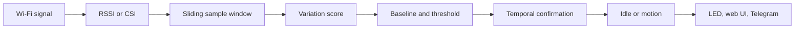
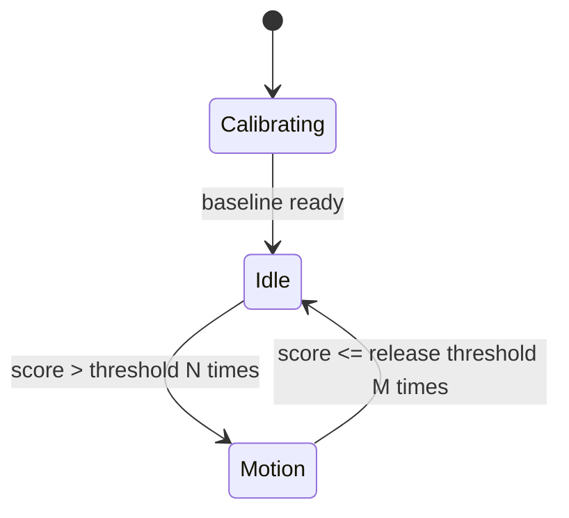

# WiFi Motion RSSI — ESP32-C3 motion sensing over Wi-Fi

**English** | [Español](README-ES.md)

WiFi Motion RSSI detects motion-compatible changes in a Wi-Fi radio link. An
ESP32-C3 observes how the channel between the access point and the board changes;
no camera, microphone, or PIR sensor is required.

The project includes RSSI and CSI detection, adaptive calibration, a responsive
English/Spanish web interface, live charts, Wi-Fi recovery, administrator
authentication, Telegram notifications, and experimental telemetry.

> [!IMPORTANT]
> This project detects **radio changes compatible with motion**, not people. It
> does not identify or count occupants, cannot guarantee detection of a motionless
> person, and is not a certified security alarm.

## Contents

- [How it works](#how-it-works)
- [What RSSI and CSI measure](#what-rssi-and-csi-measure)
- [Detection pipeline](#detection-pipeline)
- [RSSI detector](#rssi-detector)
- [CSI detector](#csi-detector)
- [Configuration reference](#configuration-reference)
- [Live status, chart, and markers](#live-status-chart-and-markers)
- [Placement and calibration](#placement-and-calibration)
- [First boot and web portal](#first-boot-and-web-portal)
- [Telegram notifications](#telegram-notifications)
- [Security](#security)
- [Flash the prebuilt firmware](#flash-the-prebuilt-firmware)
- [Build and flash from source](#build-and-flash-from-source)
- [Host tests](#host-tests)
- [Local API](#local-api)
- [Telemetry and experiments](#telemetry-and-experiments)
- [Troubleshooting](#troubleshooting)
- [Firmware architecture](#firmware-architecture)
- [Limitations](#limitations)

## How it works

A Wi-Fi signal does not travel only along a straight line. It reflects from
walls, furniture, floors, and other objects. The receiver sees multiple copies
of the same wave arriving through different paths. This is called **multipath
propagation**.

When a person or object moves, some paths are blocked and others are reflected
differently. The resulting radio pattern changes:

```text
Access point  ~~~~~ direct path ~~~~~>  ESP32-C3
       \                              /
        \_____ reflected paths _____/
                    ↑
             movement changes propagation
```

The firmware turns that disturbance into a decision:



A single spike is never enough. The detector evaluates a window of samples and
requires several consecutive threshold crossings.

## What RSSI and CSI measure

### RSSI

RSSI means *Received Signal Strength Indicator*. It is an estimate of total
received power, usually expressed in dBm. For example, `-45 dBm` is stronger
than `-75 dBm`.

The firmware periodically calls `esp_wifi_sta_get_ap_info()`. The useful signal
for motion detection is not the absolute RSSI but **how it changes over time**.
A stable sequence around `-65 dBm` produces a small score; a sequence such as
`-65, -62, -68, -64` produces a larger one.

RSSI works with an ordinary router, requires little memory and computation, and
is easy to interpret. Its main limitation is that it compresses the whole radio
channel into one value.

### CSI

CSI means *Channel State Information*. Instead of one power value, CSI describes
how the received signal behaves across OFDM subcarriers. Each subcarrier carries
complex amplitude and phase-related information.

| Measurement | Output | Intuitive analogy |
|---|---|---|
| RSSI | One global power value | Overall music volume |
| CSI | Many subcarrier values | Individual bands on an equalizer |

CSI can reveal finer changes. Its response depends on router traffic, channel,
frame format, orientation, and geometry. CSI is a supported operating method in
this project and has been verified on the reference installation; recalibrate
and check its quality counters after moving the device.

### What the system does not measure

It does not directly measure distance, speed, identity, temperature, or human
presence. Doors, pets, fans, interference, and access-point changes can also
disturb the radio link.

## Detection pipeline

RSSI and CSI use parallel detectors with the same state-machine concepts.

### 1. Sampling

Every `interval_ms`, the firmware requests a new observation. The default
`100 ms` interval means ten queries per second. The Wi-Fi driver may repeat the
same physical RSSI value, so telemetry records repeated samples separately from
query frequency.

### 2. Sliding window

The latest `window_size` samples are retained. With 20 samples at 100 ms, the
window covers approximately two seconds:

```text
window duration ≈ window_size × interval_ms
                ≈ 20 × 100 ms = 2 s
```

### 3. Variation score

The score summarizes recent variation. A small score resembles the quiet-room
reference; a larger score means the radio signal is changing more. It is not a
probability or percentage, and RSSI and CSI scores use different scales.

### 4. Calibration and baseline

At startup or during manual recalibration, the detector collects
`calibration_samples` scores while the room should be empty and still. It learns:

- the baseline center: normal variation;
- the baseline spread: normal fluctuation around that center.

With the default RSSI values, initial calibration takes approximately:

```text
(window_size + calibration_samples) × interval_ms
(20 + 120) × 100 ms ≈ 14 s
```

CSI timing also depends on enough compatible frames arriving.

### 5. Adaptive threshold

```text
trigger threshold = max(
    minimum threshold,
    baseline center + sigma multiplier × baseline spread
)
```

The minimum prevents tiny noise from triggering in a very stable room. The
statistical term raises the threshold in a naturally variable environment.
A larger sigma multiplier is less sensitive.

### 6. Temporal confirmation

The score must remain above the trigger threshold for `trigger_consecutive`
results. At 100 ms with a value of 3, ideal confirmation adds roughly 300 ms,
although the actual latency also includes the sample window and Wi-Fi updates.

### 7. Hysteresis and release

The detector returns to idle through a lower threshold:

```text
release threshold = trigger threshold × release ratio
```

For a trigger threshold of `0.40` and a ratio of `0.75`, the release threshold
is `0.30`. The score must remain below it for `clear_consecutive` results. This
hysteresis prevents rapid state oscillation near the boundary.



## RSSI detector

### Algorithms

| Algorithm | Calculation | Characteristics |
|---|---|---|
| Mean absolute difference | Mean of `abs(x[i] - x[i-1])` | Good starting point for successive changes |
| Standard deviation | Spread around the mean | General variability in RSSI-like units |
| Sample variance | Squared spread | Amplifies large differences and changes score scale |
| Range | Maximum minus minimum | Intuitive but sensitive to one spike |
| Median absolute deviation | Median of `abs(x - median(x))` | More resistant to isolated outliers |

No algorithm is universally best. Recalibrate when changing algorithms because
their score scales differ.

### Baseline models

| Model | Center | Spread | Behavior |
|---|---|---|---|
| Mean and standard deviation | Mean | Sample standard deviation | Good for regular noise; sensitive to spikes |
| Robust median | Median | MAD × 1.4826 | Better tolerance of outliers and irregular distributions |

The baseline adapts slowly while the detector is idle and safely below the
release threshold:

```text
new baseline = current baseline
             + alpha × (candidate baseline - current baseline)
```

A small `alpha`, such as `0.01`, makes adaptation deliberately slow and reduces
the risk of learning motion as the new normal.

## CSI detector

The CSI extractor calculates features including mean amplitude, amplitude
variance and range, average energy, absolute temporal change, normalized change,
and complex correlation distance between consecutive frames.

The active CSI score is derived from the aggregate peak of complex correlation
distance and enters a detector running in parallel with RSSI.

| CSI parameter | Current value |
|---|---:|
| Window | 20 |
| Calibration | 120 scores |
| Algorithm | Mean absolute difference |
| Baseline | Median/MAD |
| Sigma | 6.0 |
| Minimum threshold | 0.05 |
| Release ratio | 0.75 |
| Trigger / clear confirmation | 3 / 8 |

CSI scores are often much smaller than RSSI scores. Values such as `0.002` or
`0.009` may look like zero when rounded. If the score is exactly zero for a long
time, inspect these diagnostics:

- `csi_frames_received` and `csi_frames_processed` should increase;
- `csi_frames_dropped` should not grow continuously;
- `csi_traffic_requests` and `csi_traffic_replies` show controlled traffic;
- `csi_detector_sampled` confirms delivery of fresh detector samples.

The firmware sends controlled ICMP traffic to the gateway to encourage stable
CSI delivery. Defaults are a 50 ms interval, one payload byte, and a 200 ms
timeout.

### Detection source selector

| Web option | Main card, LED, and Telegram |
|---|---|
| RSSI only | Controlled only by RSSI |
| CSI only | Controlled only by CSI |
| RSSI or CSI | Activated when either detector triggers |

The combined option is an **OR**, not a requirement for both detectors to agree.

## Configuration reference

Wi-Fi and detector changes apply only after selecting **Save Wi-Fi and detector;
restart**. Telegram has its own independent save button.

| Parameter | Effect when increased | Risk when too small |
|---|---|---|
| Interval | Fewer queries and slower response | More load and repeated samples |
| Window | Smoother, slower score | Noisy score sensitive to spikes |
| Calibration | Better initial reference | Poor baseline from too little data |
| Sigma multiplier | Fewer triggers and false alarms | Normal noise may trigger |
| Minimum threshold | Ignores small changes | False alarms in very stable rooms |
| Release ratio | Trigger and release become closer near 1 | Very low values delay release |
| Baseline adaptation | Tracks environmental drift faster | May absorb slow disturbances |
| Trigger confirmation | Rejects isolated spikes | Short motion may not confirm |
| Clear confirmation | Holds motion state more steadily | May return to idle too early |

### Profiles

Profiles are presets that visibly update several fields before saving.

| Profile | Sigma | Release | Alpha | Trigger | Clear | Expected behavior |
|---|---:|---:|---:|---:|---:|---|
| Low sensitivity | 8.0 | 0.75 | 0.01 | 4 | 10 | Fewer false alarms, more latency |
| Balanced | 6.0 | 0.75 | 0.01 | 3 | 8 | Recommended starting point |
| High sensitivity | 4.0 | 0.70 | 0.02 | 2 | 5 | Faster, more false-positive risk |

Changing a profile does not automatically change the algorithm, baseline model,
window, or calibration sample count.

### Long decimal values

The ESP32 stores some values as 32-bit floating-point numbers. A value such as
`0.31` may internally appear as `0.310000002384186`. This is normal binary
floating-point representation, not an unexpected recalibration. The web UI
rounds values to each input's permitted step.

## Live status, chart, and markers

The main card reports calibrating, idle, motion detected, or read error. The
browser chart retains about two minutes and can independently show or hide RSSI
score, RSSI threshold, CSI score, CSI threshold, and RSSI/CSI detection markers.

A marker represents a transition from idle to motion, not every sample while
motion remains active. The `?` buttons explain each series. Chart history is not
persistent and is cleared when the page reloads; serial telemetry is the correct
source for long experimental recordings.

## Placement and calibration

1. Keep the access point and ESP32 fixed.
2. Prevent USB or jumper cables from moving the board.
3. Place the area to observe within a relevant propagation region between them.
4. Keep height, orientation, channel, and placement constant during comparisons.
5. A stable USB charger can power the board after serial monitoring is finished.

Direct line-of-sight crossing is not mandatory because reflected paths matter,
but geometry has a strong effect.

Manual recalibration can start after 10, 20, 30, or 60 seconds. Select a delay,
start recalibration, leave the room, and keep it empty until both detectors are
ready. Recalibrate after changing location, orientation, router, channel, major
furniture, algorithm, or score-scale parameters.

## First boot and web portal

### Recovery access point

The prebuilt firmware contains no home Wi-Fi credentials, so first boot starts:

```text
SSID: WiFi-Motion-XXXXXX
Password: motion-setup
Portal: http://192.168.4.1
```

Captive DNS normally opens the portal automatically. If it does not, browse to
`http://192.168.4.1`. Sign in, scan for a 2.4 GHz network, enter its password,
and save. The device restarts and joins that network.

Default administrator credentials are:

```text
Username: admin
Password: admin
```

Change the administrator password after first login.

### Recovery after moving the device

If the saved network is unavailable, the recovery AP starts automatically after
failed connection attempts without erasing detector, administrator, or Telegram
configuration.

To enter recovery immediately, let the board boot normally, hold **BOOT for five
seconds**, and release it. The board performs a one-shot restart into recovery.
Do not hold BOOT while powering or resetting the board. A normal RESET only
restarts the firmware.

### Interface language

The first visit defaults to English. `English / Español` is available on both
the login page and main application. The choice is stored in the browser, not in
the ESP32, and also updates help text, live states, accessible names, and chart
time formatting.

## Telegram notifications

1. Create a bot with `@BotFather` and keep its token private.
2. Start a conversation with it or add it to the intended group.
3. Obtain the authorized `chat_id`.
4. Enter the token and `chat_id`, enable notifications, and save Telegram.
5. Send a test message.

The token is never returned after storage; an empty token field keeps the saved
one. Automatic notifications are queued only when the **selected detection
source** enters motion. HTTPS certificate validation uses the ESP-IDF certificate
bundle, and a separate FreeRTOS queue avoids blocking detection.

Current limits are an 8-second network timeout, a six-message queue, and a
30-second automatic notification cooldown.

## Security

- The fixed administrator username is `admin`.
- Passwords use PBKDF2-HMAC-SHA-256, random salt, and 20,000 iterations.
- Five failed logins cause a 30-second lockout.
- Random sessions expire after 30 minutes of inactivity.
- Session cookies use `HttpOnly` and `SameSite=Strict`.
- Configuration and diagnostic endpoints require authentication.
- Telegram tokens are never returned by the API.
- Normal configuration exports exclude secrets.

The local portal uses HTTP, not HTTPS. Use a trusted LAN, change the default
password, do not forward port 80, and never expose the ESP32 directly to the
Internet.

## Flash the prebuilt firmware

The [`firmware/`](firmware/) directory contains binaries for an ESP32-C3
SuperMini with 4 MB flash. No ESP-IDF checkout is required; only Python and
Espressif's `esptool` are needed.

### Linux or macOS

```bash
python3 -m pip install --user esptool
PORT=/dev/ttyACM0 ./firmware/flash-prebuilt.sh
```

On macOS the port commonly looks like `/dev/cu.usbmodem*`.

### Windows PowerShell

```powershell
py -m pip install esptool
py -m esptool --chip esp32c3 --port COM5 --baud 460800 `
  --before default-reset --after hard-reset write-flash `
  0x0 firmware/wifi-motion-rssi-c3-complete.bin
```

Replace `COM5` with the actual port. See [firmware/README.md](firmware/README.md)
for the separate-image command, file hashes, and recovery tips.

The prebuilt files contain project defaults and no development machine's home
SSID, Wi-Fi password, administrator state, or Telegram token. The recommended
`flash-prebuilt.sh` writes three separate images and preserves NVS. The combined
factory image spans the NVS address range and deliberately clears runtime
configuration. Use it only for a clean installation.

## Build and flash from source

### Requirements

- ESP32-C3 SuperMini with 4 MB flash;
- USB data cable;
- Linux or macOS shell environment;
- Git, CMake, a C compiler, and Python 3 for host tests;
- Internet access during the first dependency installation.

The included binaries were built with ESP-IDF commit
`12f36a021f511cd4de41d3fffff146c5336ac1e7`, described locally as
`v6.1-dev-2938-g12f36a021f`.

### Install the exact ESP-IDF revision

```bash
./tools/bootstrap.sh
source "$HOME/esp/esp-idf-12f36a021f/export.sh"
```

`bootstrap.sh` clones the exact commit, initializes its submodules, and installs
the ESP32-C3 toolchain. Override `IDF_ROOT` or `IDF_REF` only when intentionally
using another location or revision.

### Configure and build

```bash
idf.py menuconfig                 # optional
./tools/build.sh
```

The **WiFi motion detector** menu controls bootstrap Wi-Fi credentials, recovery
AP password, LED and button GPIOs, CSI, controlled traffic, and telemetry format.
Runtime settings can later be changed from the portal.

Build outputs are created under `build/`. To flash and open the monitor:

```bash
PORT=/dev/ttyACM0 ./tools/flash.sh
```

Or run the ESP-IDF commands separately:

```bash
idf.py -p /dev/ttyACM0 flash
idf.py -p /dev/ttyACM0 monitor
```

Exit the monitor with `Ctrl+]`.

## Host tests

```bash
./tools/test-host.sh
```

The suites cover motion detection, configuration, sample metrics, event markers,
CSI features, authentication, Telegram validation, captive DNS, BOOT recovery,
the portal, and experiment tools. All tests and a full firmware build must pass
before a phase is considered complete.

## Local API

Except for login and session lookup, operational endpoints require an
authenticated session.

| Method and route | Purpose | Secret exposure |
|---|---|---|
| `GET /api/session` | Check current session | No |
| `POST /api/login` | Sign in | Receives password |
| `POST /api/logout` | End session | No |
| `POST /api/password` | Change admin password | Receives old and new password |
| `GET /api/config` | Read effective configuration | Does not return Wi-Fi password |
| `POST /api/config` | Validate, persist, restart | May receive a new Wi-Fi password |
| `POST /api/wifi/scan` | Start asynchronous scan | No |
| `GET /api/wifi/scan` | Read scan results | No |
| `GET /api/diagnostics` | Live state and counters | No |
| `POST /api/calibrate` | Schedule recalibration | No |
| `GET /api/export` | Normal configuration export | No |
| `GET /api/export?include_secrets=1` | Explicit Wi-Fi export | Yes; handle securely |
| `POST /api/import` | Import versioned configuration | May receive Wi-Fi secrets |
| `POST /api/factory-reset` | Erase configuration and credentials | No |
| `GET /api/telegram` | Telegram state | Never returns token |
| `POST /api/telegram` | Save Telegram settings | May receive token |
| `POST /api/telegram/test` | Queue a test | No |

The persistent configuration schema is version 4. Compatible older
configurations are migrated and all ranges are validated before NVS storage.

## Telemetry and experiments

Serial output supports CSV or JSON Lines. Every scheduled query emits a record,
including failures, so observation gaps remain visible. Fields cover uptime,
sample validity, RSSI, algorithm, baseline, thresholds, state transitions, CSI
features and counters, controlled traffic, repeated samples, reconnects, channel,
BSSID, and physical event markers.

See [EXPERIMENT_PROTOCOL.md](EXPERIMENT_PROTOCOL.md) and the phase result files
for the evaluation workflow. A minimal RSSI stability capture can be validated
with:

```bash
timeout 925s minicom -D /dev/ttyACM0 -b 115200 \
  -C phase1-session.log -o
python3 tools/validate_phase1.py phase1-session.log
```

Do not pipe `idf.py monitor` to `tee`; depending on its controlling TTY, the
monitor may bypass the pipe and leave an empty file.

## Troubleshooting

### The Telegram test works but automatic notifications do not

Confirm notifications are enabled and saved, inspect the selected detection
source, wait for calibration, and remember the 30-second cooldown. A test message
validates Telegram transport but does not prove that the selected detector is
entering motion.

### CSI score is zero or nearly zero

Inspect CSI frame and controlled-traffic counters. A score of `0.002` is not
zero; it is simply below the current `0.05` minimum threshold. If counters
advance, recalibrate and compare score with threshold before changing sources.

### Score exceeds threshold but state does not change

The score must exceed it for the configured trigger confirmation count. Release
uses another threshold and counter. Ensure the chart series matches the selected
detection source.

### Continuous motion detection

Let calibration finish, recalibrate with the room empty, secure all cables, try
Balanced or Low sensitivity, and check for router channel or interference
changes before forcing extreme thresholds.

### An obvious crossing is missed

Try RSSI only, confirm its chart score changes, temporarily use High sensitivity,
adjust sigma in small steps, and improve placement before extreme tuning.

### The button remains on Saving or Restarting

Saving Wi-Fi or detector settings restarts the board. The page reloads after
seven seconds. If the address changed, check the router or use recovery mode.
Telegram has a separate save button and does not restart the ESP32.

### The device was moved and no longer appears on the router

Wait for automatic recovery or hold BOOT for five seconds after normal startup,
then release it. Join `WiFi-Motion-XXXXXX` with `motion-setup` and select the new
network. A factory reset is unnecessary.

### Browser warns about a password field over HTTP

That warning is correct. The portal is local HTTP. Use a trusted network and do
not expose it to the Internet.

## Firmware architecture

```text
main/app_main.c
├── app_config          versioned NVS configuration
├── motion_detector     window, score, baseline, state machine
├── sample_metrics      sampling cadence and quality
├── csi_capture         Wi-Fi callback and queue handoff
├── csi_features        CSI feature extraction
├── csi_traffic         controlled gateway traffic
├── event_marker        physical experiment markers
├── config_portal       HTTP server, UI, API, diagnostics
├── portal_auth         administrator password and sessions
├── captive_dns         recovery portal DNS responder
├── recovery_button     BOOT press state machine
└── telegram_notifier   HTTPS transport and notification queue
```

CSI callbacks perform minimal work and pass frames to a queue. Feature processing
and Telegram networking run outside timing-sensitive callbacks. Wi-Fi, detector,
authentication, and Telegram use separate NVS namespaces.

## Project status

- Phases 0–3: completed.
- Phase 4 RSSI campaign: closed as inconclusive because the available geometry
  did not support defensible performance claims.
- Phase 5 CSI: functional on the current installation; broader validation remains
  environment-dependent.
- Phases 6A–6C: admin access, Wi-Fi selection, and Telegram completed.
- Phases 7A–7C: supported CSI presentation, recovery/mobile portal, and bilingual
  interface completed and verified on hardware.

See [PLAN.md](PLAN.md) for phase gates and evidence.

## Limitations

- A completely motionless person is not detected reliably.
- Coverage is not uniform across every room.
- The device does not count, identify, or locate people.
- It cannot distinguish a person from every other physical or radio change.
- RSSI depends strongly on router, channel, traffic, orientation, and geometry.
- CSI depends on compatible traffic and geometry.
- Browser chart history is not persistent.
- Telegram depends on Internet, DNS, TLS, and Bot API availability.
- The local portal is HTTP, not HTTPS.
- This is not a certified medical, security, or occupancy device.

## Related documentation

- [Spanish README](README-ES.md)
- [Phase plan](PLAN.md)
- [Experiment protocol](EXPERIMENT_PROTOCOL.md)
- [Phase 1 results](PHASE1_RESULTS.md)
- [Phase 2 results](PHASE2_RESULTS.md)
- [Phase 3 results](PHASE3_RESULTS.md)
- [Phase 4 results](PHASE4_RESULTS.md)
- [Alternative signal-processing plan](PLAN_ALTERNATIVO_PROCESADO_SENAL.md)

## Technical references

- Kosba et al., [RASID: A Robust WLAN Device-Free Passive Motion Detection System](https://arxiv.org/abs/1105.6084)
- Xiao et al., [FIMD: Fine-Grained Device-Free Motion Detection](https://doi.org/10.1109/ICPADS.2012.49)
- [PhaseMode: A Robust Passive Intrusion Detection System](https://doi.org/10.1155/2018/8243905)
- Espressif, [ESP-CSI](https://github.com/espressif/esp-csi)
- Espressif, [ESP-CSI Solution / ESP-Radar](https://docs.espressif.com/projects/esp-techpedia/en/latest/esp-friends/solution-introduction/esp-csi/esp-csi-solution.html)

## License

The repository does not currently include a `LICENSE` file. Choose an explicit
license before redistribution, reuse, or accepting external contributions.
