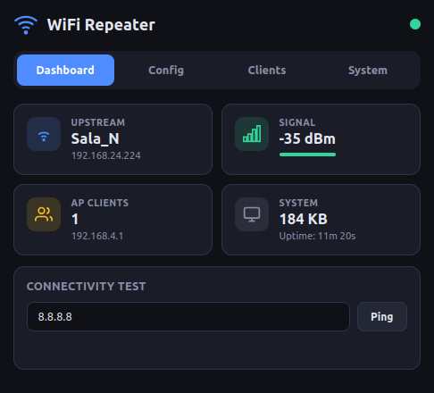
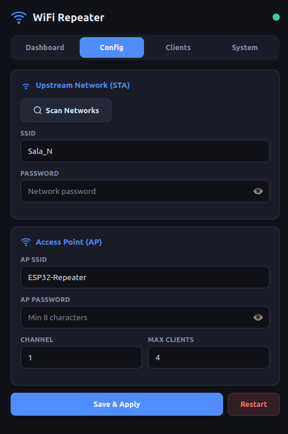
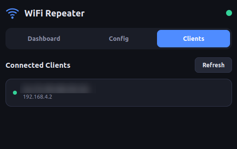
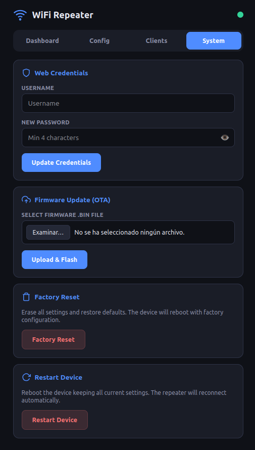

# 📡 ESP32-C3 WiFi Repeater

Repetidor WiFi completo basado en **ESP32-C3-SuperMini**. Se conecta a una red WiFi existente y crea un punto de acceso propio para extender la cobertura. Toda la configuración se realiza mediante una **interfaz web profesional** servida desde el propio dispositivo.

## Capturas de pantalla

| Dashboard | Configuración |
|:-:|:-:|
|  |  |

| Clientes | System |
|:-:|:-:|
|  |  |

## Características

- 📶 **Repetidor WiFi** — Modo STA+AP simultáneo con NAPT (Network Address Port Translation)
- 🌐 **Web UI Profesional** — Dark theme, responsive, mobile-first, sin frameworks externos
- 🔍 **Escaneo de redes** — Detecta redes WiFi disponibles desde la interfaz
- 🧭 **Captive Portal** — Redirige automáticamente al panel al conectarse (se desactiva cuando hay internet)
- 💾 **Persistencia NVS** — La configuración sobrevive a reinicios
- 📊 **Dashboard en tiempo real** — RSSI, clientes conectados, heap libre, uptime
- 🏓 **Test de conectividad** — Ping integrado (ICMP) con resolución DNS para verificar acceso a internet
- 🔄 **DNS automático** — Propaga el DNS upstream a los clientes del AP vía DHCP
- 🔒 **Autenticación web** — HTTP Basic Auth con credenciales configurables
- 🔄 **OTA Updates** — Actualización de firmware vía web con dual partitions y rollback automático
- 🗑️ **Factory Reset** — Restaurar configuración de fábrica desde la interfaz web

## Hardware necesario

| Componente | Detalle |
|---|---|
| **Placa** | ESP32-C3-SuperMini |
| **Chip** | ESP32-C3 (RISC-V single core 160MHz) |
| **Flash** | 4MB |
| **WiFi** | 802.11 b/g/n, 2.4GHz |
| **Conector** | USB-C |

> 💡 Estas placas cuestan ~2€ en AliExpress y son del tamaño de una moneda.

---

## Flashear el binario precompilado (sin compilar)

Si solo quieres flashear directamente sin instalar ESP-IDF, necesitas **esptool**:

### 1. Instalar esptool

```bash
pip install esptool
```

### 2. Conectar el ESP32-C3-SuperMini por USB-C

Identificar el puerto:

```bash
# Linux
ls /dev/ttyACM* /dev/ttyUSB*

# macOS
ls /dev/cu.usb*

# Windows → buscar COMx en el Administrador de dispositivos
```

### 3. Flashear

```bash
esptool.py --chip esp32c3 -b 460800 \
  --before default-reset --after hard-reset \
  write_flash --flash_mode dio --flash_size 4MB --flash_freq 80m \
  0x0      firmware/bootloader.bin \
  0x8000   firmware/partition-table.bin \
  0xf000   firmware/ota_data_initial.bin \
  0x20000  firmware/wifi_repeater.bin
```

> ⚠️ Sustituye el puerto si es necesario añadiendo `-p /dev/ttyACM0` (Linux) o `-p COM3` (Windows).

> 💡 Si no detecta la placa, mantén pulsado el botón **BOOT** mientras conectas el USB.

---

## Compilar desde el código fuente

### Requisitos

- **ESP-IDF v5.x o superior** ([guía de instalación](https://docs.espressif.com/projects/esp-idf/en/stable/esp32/get-started/))

### Compilar

```bash
# Activar entorno ESP-IDF
source ~/esp/esp-idf/export.sh

# Configurar target (solo la primera vez)
idf.py set-target esp32c3

# Compilar
idf.py build
```

### Flash + Monitor

```bash
idf.py -p /dev/ttyACM0 flash monitor
```

> Para salir del monitor: `Ctrl+]`

---

## Uso

1. **Flashear** el firmware en el ESP32-C3-SuperMini
2. **Conectarse** a la red WiFi **`ESP32-Repeater`** (contraseña: `12345678`)
3. **Abrir** [http://192.168.4.1](http://192.168.4.1) en el navegador (o esperar al captive portal)
4. **Login** con usuario `admin` y contraseña `admin`
5. Ir a **Config** → **Scan Networks** → seleccionar la red WiFi a repetir
6. Introducir la contraseña y pulsar **Save & Apply**
7. Verificar en **Dashboard** que aparece la IP y el indicador de señal
8. Usar **Ping** (en el dashboard) para comprobar que hay acceso a internet

### Credenciales por defecto

| Campo | Valor |
|---|---|
| **Usuario** | `admin` |
| **Contraseña** | `admin` |

> 🔐 Puedes cambiar las credenciales desde la pestaña **System** → **Web Credentials** en la interfaz web.

### Actualización OTA

1. Compilar el nuevo firmware (`idf.py build`)
2. Ir a la pestaña **System** → **Firmware Update (OTA)**
3. Seleccionar el archivo `build/wifi_repeater.bin`
4. Pulsar **Upload & Flash** — el dispositivo se reinicia automáticamente
5. Si el nuevo firmware falla, se revierte al anterior automáticamente (rollback)

### Factory Reset

Desde la pestaña **System** → **Factory Reset** puedes restaurar toda la configuración a valores de fábrica. El dispositivo borra NVS y reinicia con los valores por defecto (AP: `ESP32-Repeater`, pass: `12345678`, credenciales: `admin/admin`).

## API REST

| Endpoint | Método | Descripción |
|---|---|---|
| `/api/status` | GET | Estado del sistema (STA, RSSI, clientes, heap, uptime) |
| `/api/scan` | GET | Escanear redes WiFi disponibles |
| `/api/config` | GET | Obtener configuración actual |
| `/api/config` | POST | Guardar nueva configuración (JSON) |
| `/api/clients` | GET | Listar clientes conectados al AP con MAC e IP |
| `/api/ping` | POST | Test de conectividad ICMP `{"target":"8.8.8.8"}` |
| `/api/restart` | POST | Reiniciar el dispositivo |
| `/api/auth/check` | GET | Verificar credenciales (login) |
| `/api/auth/change` | POST | Cambiar credenciales `{"new_user":"...","new_pass":"..."}` |
| `/api/ota` | POST | Subir firmware binario (OTA update) |
| `/api/factory-reset` | POST | Restaurar configuración de fábrica y reiniciar |

> 🔒 Todos los endpoints `/api/*` requieren HTTP Basic Auth.

## Estructura del proyecto

```
WiFi-Repeater/
├── README.md                  # Este archivo
├── CMakeLists.txt             # Build system ESP-IDF
├── sdkconfig.defaults         # Configuración del SDK
├── partitions.csv             # Tabla de particiones (OTA dual: ota_0 + ota_1)
├── firmware/                  # Binarios precompilados
│   ├── bootloader.bin
│   ├── partition-table.bin
│   ├── ota_data_initial.bin
│   └── wifi_repeater.bin
├── img/                       # Capturas de pantalla
│   ├── dashboard.png
│   ├── config.png
│   ├── clients.png
│   └── system.png
├── main/
│   ├── main.c                 # Entry point + OTA rollback validation
│   ├── wifi_manager.c/h       # WiFi STA+AP, NAPT, ping
│   ├── web_server.c/h         # HTTP server + API REST + Auth + OTA
│   ├── config_storage.c/h     # Persistencia NVS (WiFi + web credentials)
│   └── embedded_files/        # Web UI embebida
│       ├── index.html
│       ├── styles.css
│       └── app.js
└── components/
    └── dns_server/            # Captive portal DNS
```

## Cómo funciona internamente

```
┌─────────────────┐         ┌───────────────────┐         ┌─────────────┐
│  Dispositivo    │  WiFi   │  ESP32-C3         │  WiFi   │  Router     │
│  (móvil, PC)    │◄───────►│  AP ◄─ NAPT ─► STA│◄───────►│  (Internet) │
│                 │  AP     │  192.168.4.1      │  STA    │             │
└─────────────────┘         └───────────────────┘         └─────────────┘
```

## Licencia

MIT
